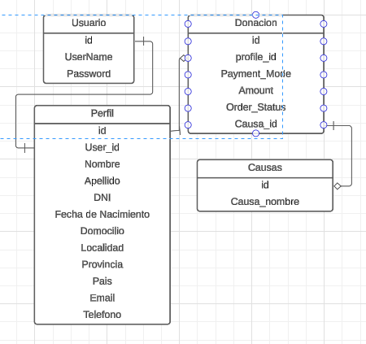

# SMART HELP

## Documentación

- Clona el repositorio de GitHub utilizando el comando `git clone --URL`
- Instala los paquetes de Node con el comando `npm install`
- Ejecuta el comando `npm start`

## Modelos de Entidad Relacional

<strong>Diagrama de Entidad Relacional</strong>

<i>Diagrama de entidad relacional del usuario</i>
 

flujo de datos para realizar el correspondiente donativo.

## Prisma se está utilizando como ORM , sus comandos son

- [Prisma](https://prisma.io)
- Instalacion de Prisma `npm install prisma --save-dev`
- Inicializar Prisma `npx prisma init --datasource-provider PostgreSQL`
- Crear el Schema de Prisma
- Crear el Cliente de Prisma `npx prisma generate`
- Si ya se tiene una base de datos puede usarse el comando `npx prisma db pull` para crear el Schema basado en ella
- Ejecutar el comando para la migracion `npm prisma migrate dev --name nombreMigra`

## VARIABLES DE ENTORNO

- `DATABASE_URL`: URL de la base de datos
- `NODE_ENV`: `development` o `production`

## Datos de pago Mercado Pago

- Agregar credenciales de Mercado Pago
- Mastercard 5416 7526 0258 2580 11/25
- CVC: 123
- APRO

## Imagen de Docker para la BDD PostgreSQL

- Instalar Docker, en widows y mac, por defecto viene instalado Docker compose
- Agregar un archivo .env en la raiz del proyecto
- Agregar las siguientes variables de entorno: -`POSTGRES_DB=smarthelp_bd
POSTGRES_USER=smart_help
POSTGRES_PASSWORD=password123`
- Ejecuta el comando `docker-compose up`, y se inicializara una imagen de postgres con la BDD ya creada.

## Credenciales Clerk

- Credenciales de la aplicacion `clerk`
- Agregar las Variables de entorno al archivo .env
- `NEXT_PUBLIC_CLERK_PUBLISHABLE_KEY`
- `CLERK_SECRET_KEY`

## Como arrancar el proyecto

- Clonar el archivo .env.example y renombrarlo como .env
- Agregar variables de entorno
- Agregar las variables de Clerk
- Comprobar la Base de datos
- Levantar contenedor de docker en caso de ser necesario
- Ejecutar el comando `npm run seed` para cargar la data en la base de datos
- Ejecutar el comando `npm run dev` para iniciar el servidor

## Crear un Tunel para Mercado Pago

- Primero instalar cloudflared
- `winget install --id Cloudflare.cloudflared`
- Actualizar Cloudflared `cloudflared update` como administrador
- `cloudflared tunnel --url http://localhost:3000`
- Agregar la URL a Webhook de Mercado Pago mas el url/payment

## Solicitar clave de cuenta de google para nodemailer

- https://security.google.com/settings/security/apppasswords
- Envio de Email usando Nodemailer
- EMAIL_USER=**\***@gmail.com
- EMAIL_PASSWORD=**\*\*\*\***

//moviendo info